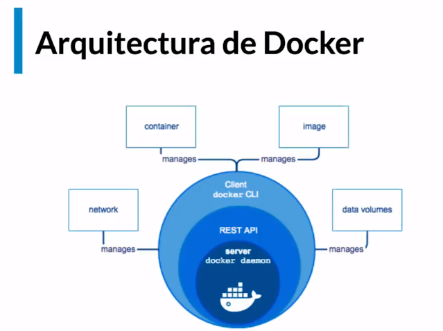

# Doker
Nos ayuda a trabajar, rápido, con confianza y brinda una mejor forma de desarrollar e implementar código.

## Problemas del desarrollo profesional
1. Construir
2. Distribuir
3. Ejecutar: Como armamos el software y como puede corre como quisieramos.

Contruir software: Sólo es una pequeña parte y la mayoria de los problemas son atacados por equipos.

* Entorno de desarrolo: Ambiente con el que corremos, versiones y demás.
* Dependencias: Complementos, framework, etc.
* Entorno de ejecución: Versiones
* Equivalencia con entorno productivo
* Serivios externos: comunicación con base de datos, etc.

**Distribuir Software:** El codigo tiene que transformarse en un artefacto, o varios, que puedan ser transpordados y donde deben ser ejecutados:

Los principales problemas son
* Divergencia de repositorios
* Divergencia de artefactos
* Versionado

**Problema al ejecutar software**:

* Compatibilidad con el entorno productivo
* Dependencias
* Disponibilidad de servicios externos
* Recursos de hardware

Los problemas son infinitos y nos preguntamos ¿Y ahora que hacemos? `Doker nos permite construir, distribuir y ejecutar cualquier aplicacion en cualquier lugar o ambiente.`

## Virtualización

Es la versión digital de algun recurso. Nos permite atacar en simultaneo los 3 problemas mencionados anteriormente acerca del desarrollo de software.

## Maquinas virtuales
Problemas de las VMs

* Peso: En orden de los GBs. Repiten archivos en común e inicio lento
* Costo de administración: Necesitan mantenimiento igual que cualquier otra computadora.
* Multiples formatos: VDI, VMDK, VHD, raw, etc.

## Contenedor
Ataca el problema de las máquinas virtuales y todos los prolemas que representan.

Busca homegeneizar la manera de trasladar un objeto.

Caracteristicas:
* Flexibles
* Livianos
* Portables: Diseñados para correr de la misma manera en cualquier maquina
* Bajo acoplamiento
* Escalables
* Seguros

Todos los contenedores que corremos en la maquina reutiliza el kernel y ayuda a reutilizar código. Un contenedor no buscará competir con otro. 
Son escalables y muy sencillos de mantener. 
Un contenedor solo puede acceder a lo que necesita del SO y está restringido a otras areas, esto permite que sean seguros.

Comparativo entre contenedores vs VMs:

Si nuestros contenedores no necesitariamos replicar ni binarios ni bibliotecas.

## Conseguir Docker

* Para descargar doker selecciona [aquí](docker.com) 

* Doker hub: Es el repositorio publico donde desarrollamos nuestros desarrollos. 

* Si existe una complicación con Docker podemos usar [play with Docker]() tiene un limite de uso de 4horas.

***Docker corre nativamente en Linux***.

Para verificar que Docker funciona correctamente podemos usar `docker version` y para más detalles podemos usar `docker info`

## Arquitectura Docker

Hay 4 entidades, los contenedores son el corazon y donde corren los aplicativos

* Docker:
* Imagenes: Es donde se empaquetan los contenedores
* Volumenes de datos: Es como nos permite acceder de forma segura a los espacios de almacenamiento.
* Network: Le permite a los componentes comunicarse entre si y otros dispositivos.

## Primer ejercicio

`docker run hello-world` Correr el contenedor Hello world. Lo que es que conoce Hello-World y trata de buscarlo del repo. El output es lo que hace el contenedor (escupe texto)

Podemos ver un contenedor como una VM más ligera. El contenedor es una agrupación lógica, sin embargo, está limitado a ver o acceder de parte de una máquina anfitriona según las limitantes que le indicamos.

Lo que corre dentro del Contenedor es lo que se le indica, no tiene ni idea que existe algo afuera. Es hiper liviano y corre de forma nativa y limitado a como queramos.